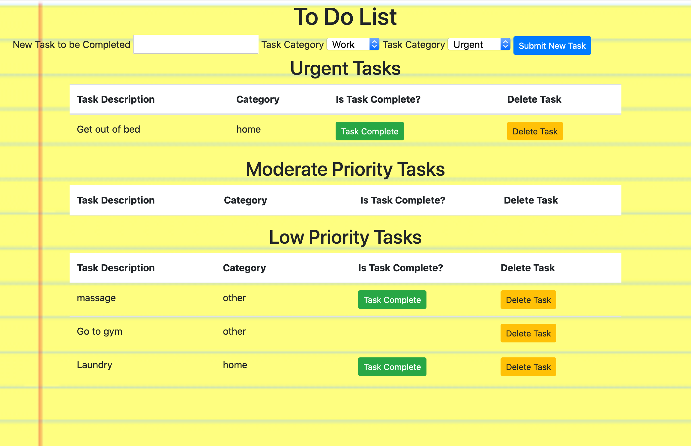

# SQL To-Do List

## Description

Duration: 54 hours - evening 10/16/2020 - evening 10/18/2020

This project is a to do app that takes tasks to be completed from the input boxes on the DOM, and uses various http requests
to manipulate the data and send it back and forth to the server and display it on the DOM.  It takes an input box for text
to list the task, a dropdown box to select the category for the task, and a dropdown to select the urgency of the task.  There
are three levels of urgency to choose from and this determines which of the three tables the task is listed under.

The main challenge for the prohect was properly working with a database and inserting, removing, and editing data from it.  
The put request was a new component, as that had been learned since the previous project which did use GET and PUT requests.  

The project had an interesting component, in that Bootstrap was requested to be used for styling.  This was a bit challenging to learn, because I had 
an idea of how I wanted to style the project and I did a certain amount of this before I started to try to use Bootstrap.  Bootstrap made what I had done previously ineffective,
and I had to decide to take pieces of what it offered to use, but keep some of my own styling, and adjust the final outcome I had
envisioned, which looked and worked much better in the end, anyway.

## Screen Shot 

### Prequisites

- The project requires Node.  It may be downloaded here: https://nodejs.org/en/

- The project required jQuery.  It is included in the vendors folder

- The project requires Bootstrap.  It is included in the styles folder and scripts folder

- The project requires the creation of a database.  Postgresql was used for this project.  The database is titled weekend-to-do-app and a command for creating the "tasks" table is in the database.sql file.  It may be found here: https://www.postgresql.org/.  Postico also may be used to visually see the database.  It is found here: https://eggerapps.at/postico/

- The project requires an understanding of HTML, CSS, JavaScript, jQuery, http requests to a server, queries to a database, and an understanding of pool

## Installation

The project can be forked and cloned from the Github repository.  The command 'npm install' in the terminal will install the necessary dependancies.  If you wish,
you may include the command "node server/server.js' as value to a property called 'start' in the object under scripts in the package.json file.  

A Postgresql database is required.  The database may be created with the name weekend-to-do-app and the text in the database.sql file may be copied and pasted in the SQL Query section of Postico, and executed.  

At this point, a browser may be send to localhost:5000, and the app should be ready to use.

## Usage

1.  The page loads with three inputs at the top that are all required for submission.  The first is a text box to type the text that describes the task to complete.
It has a maximum of 500 characters.  The second is a dropdown for the category of the task, such as home or family.  The third is the urgency of the task, ranging
from urgent to low priority.

2.  Once a task is submitted in the input section, it will show up in one of the three table sections below depending on how urgent it is.

3.  After a task has been created, the urgency level may be changed, if desired, to go to another section, by clicking the up or down buttons.  It is not designed to move up and down within
the same section. 

4.  A task may be marked as completed by clicking the 'task complete' button.  It will be moved to the botton of the section, with a line through it.

5.  A task may be deleted permanently by clicking the 'delete task' button.  This cannot be undone.

## Built With

- HTML
- CSS
- JavaScript
- jQuery
- Node
- Express
- Postgresql
- Pool
- Bootstrap

Additional README details can be found [here](https://github.com/PrimeAcademy/readme-template/blob/master/README.md).
